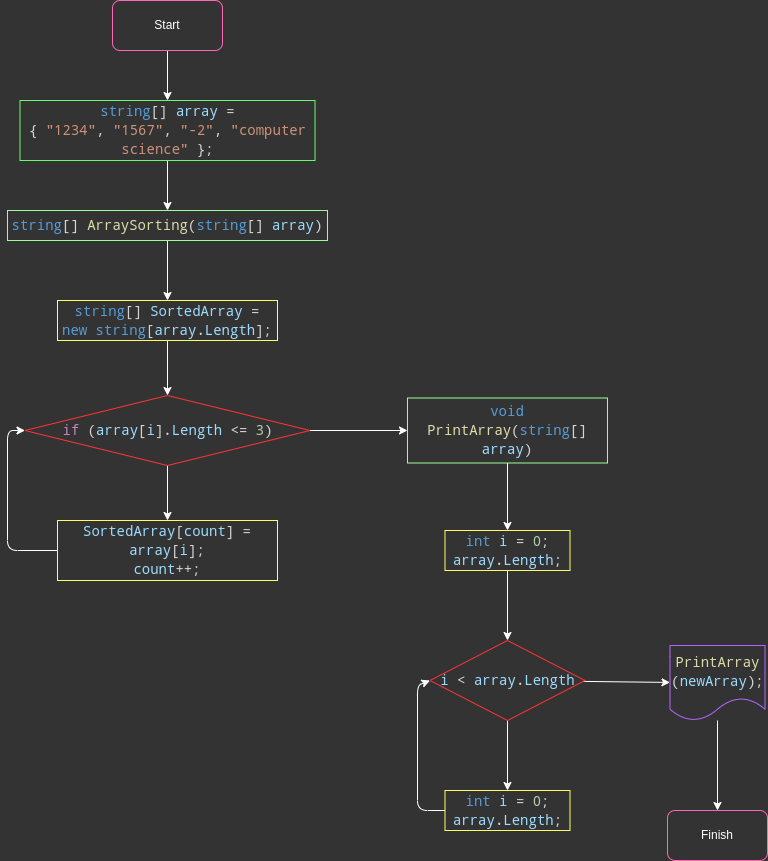

# TestWork001

>**Условие задачи**: написать программу, которая из имеющегося массива строк
формирует массив из строк, длина которых меньше либо
равна 3 символа.

### Описание решения

1. Задан массив в начале выполнения алгоритма.
2. Объявлен новый массив для отсортированных значений.
3. Задан метод для поиска обусловленных элементов в массиве через цикл for.
4. Задан метод для вывода всех элементов в заданном массиве.
5. Вызван метод сортировки и вывода.

  

